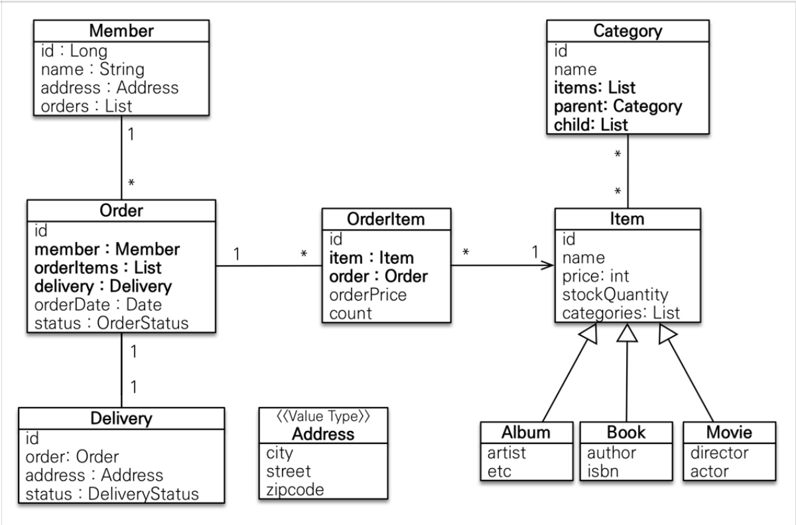

# 엔티티 분석

### 회원(Member) 
- 이름과 임베디드 타입인 주소(Address), 주문(orders) 리스트를 가진다.
### 주문(Order)
- 한 번 주문시 여러 상품을 주문할 수 있으므로 주문과 주문상품(OrderItem)은 일대다 관계이다.
- 주문은 상품을 주문한 회원(Member)과 배송정보(Delivery), 주문 날짜(orderDate), 주문상태(status)를 가지고 있다.
- 주문상태는(status) 주문(ORDER), 취소(CANCEL) 열거형이다.
### 주문상품(OrderItem)
- 주문한 상품 정보와 주문 금액(orderPrice), 주문수량(count) 정보를 가지고 있다.
### 상품(Item)
- 이름(name), 가격(price), 재고수량(stockQuantity)을 가지고 있다.
- 상품을 주문하면 재고수량이 줄어든다.
- 상품 종류로는 도서(Book), 음반(Album), 영화(Movie)가 있는데 각각은 사용하는 속성이 조금씩 다르다.
### 배송(Delivery)
- 주문시 하나의 배송 정보를 생성한다.
- 주문(Order)과 배송(Delivery)은 일대일 관계이다.
### 카테고리(Category)
- 상품(Item)과 다대다 관계이다.
- parent, child로 부모, 자식 카테고리를 연결한다.
### 주소(Address)
- 값 타입(임베디드 타입)이다. 회원(Member)과 배송(Delivery)에서 사용한다.

